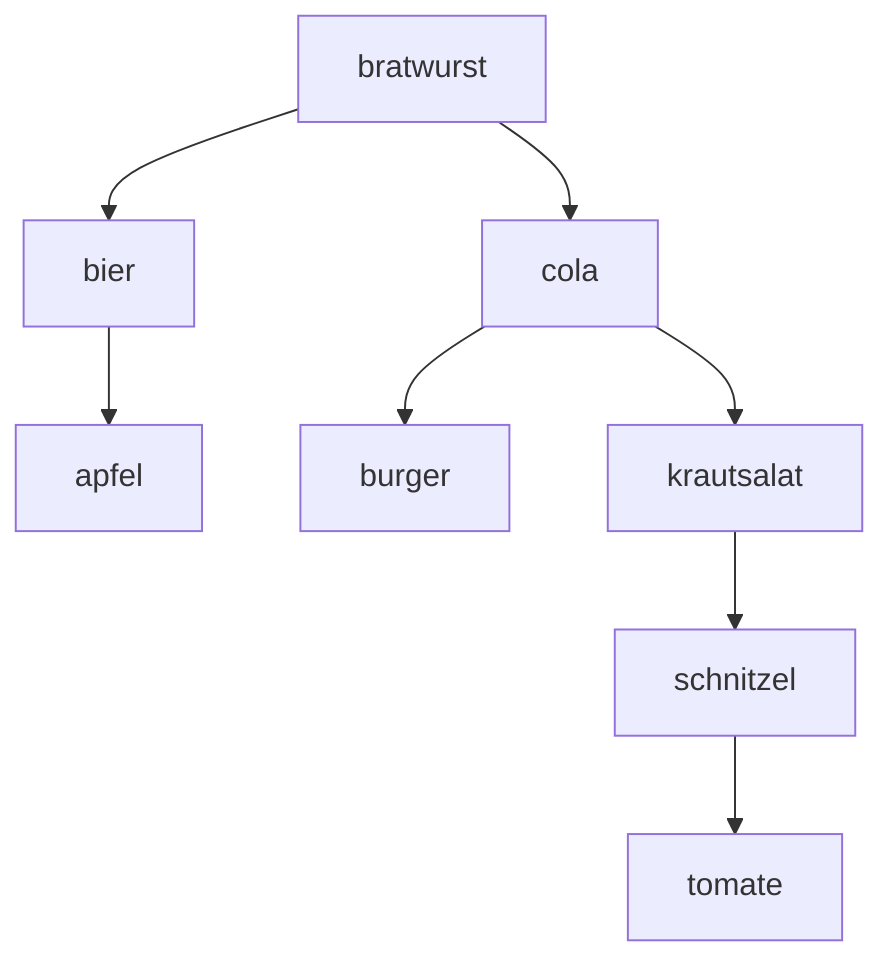

# Übungen

## 1

### a)

`gets()` ist deshalb gefährlich, weil es beim Einlesen der Eingabe keinerlei Längenprüfung durchführt – die Funktion kennt die Größe des Zielpuffers gar nicht und liest einfach so lange Zeichen ein, bis ein Zeilenumbruch oder das Dateiende kommt.

**Konkret im Beispielcode:**

Der Puffer ist mit `char username[512];` auf 512 Bytes begrenzt. Gibt jemand aber mehr als 512 Zeichen ein, schreibt `gets()` trotzdem munter weiter – über das Ende von `username[]` hinaus. Das nennt man einen **Buffer Overflow**.

**Warum das schlimm ist:**

1. **Speicher wird überschrieben** – die Daten, die nach `username` im Speicher liegen (z. B. `password`, der Rückgabewert der Funktion (return address), andere Variablen) werden mit den überzähligen Eingabedaten überschrieben.

2. **Programmabsturz** – im harmlosesten Fall stürzt das Programm einfach ab (Segmentation Fault), weil wichtige Speicherbereiche zerstört wurden.

3. **Sicherheitslücke (Code-Injection)** – im schlimmsten Fall kann ein Angreifer die Eingabe gezielt so gestalten, dass die überschriebene Rücksprungadresse auf eingeschleusten Schadcode zeigt. Das Programm springt dann in vom Angreifer kontrollierten Code – ein klassischer Stack-Buffer-Overflow-Exploit, wie er z. B. beim berühmten Morris-Wurm 1988 ausgenutzt wurde.

4. **Kein Fehler erkennbar** – `gets()` gibt keinen Fehlercode zurück, der auf einen Überlauf hinweist. Das Problem bleibt unbemerkt, bis es kracht.

### b)

- Man sollte sich auf eine Repräsentation einigen, um Fehlinterpretation der Daten vorzubeugen.
- Bei der Übertragung
- Datenlast könnte reduziert werden

### c)



## 2

### e)

$$\text{Name}(\text{x-Position | y-Position})$$

## 3

### a)

**Big-Endian-Interpretation:**
Die Bytes werden in der gegebenen Reihenfolge gelesen:
```
CA FF EE 00 → 0xCAFFEE00
```
Dezimal:
$$0xCAFFEE00 = 202 \cdot 256^3 + 255 \cdot 256^2 + 238 \cdot 256^1 + 0 \cdot 256^0 = 3.405.770.240$$

**Little-Endian-Interpretation:**
Die Bytes werden in umgekehrter Reihenfolge gelesen:
```
00 EE FF CA → 0x00EEFFCA
```
Dezimal:
$$0x00EEFFCA = 0 \cdot 256^3 + 238 \cdot 256^2 + 255 \cdot 256^1 + 202 \cdot 256^0 = 15.663.050$$

### b)

**Two's-Complement (Zweierkomplement):**
Die in der Praxis (fast) universell verwendete Methode zur Darstellung negativer Zahlen. Man bildet sie, indem man die Bits der positiven Zahl invertiert und dann 1 addiert. Vorteil: Addition/Subtraktion funktionieren mit demselben Schaltkreis wie bei positiven Zahlen, und es gibt nur eine Darstellung der Null.

**One's-Complement (Einerkomplement):**
Eine ältere, heute kaum noch genutzte Methode zur Darstellung negativer Zahlen. Man invertiert einfach alle Bits der positiven Zahl (ohne +1). Nachteil: Es gibt zwei Darstellungen der Null (+0 und −0).

**ASCII-Zeichen-Array:**
Statt die Zahl binär zu kodieren, wird sie als **Text** dargestellt — jedes Zeichen (Ziffer, Minuszeichen) wird einzeln nach der ASCII-Tabelle in ein Byte kodiert. Das ist z. B. nötig, wenn eine Zahl in einer Textdatei oder auf einem Bildschirm ausgegeben werden soll.

---

#### Berechnung

**Schritt 1: Betrag 107 in Binär/Hex**
$$107_{10} = 0110\,1011_2 = \text{0x6B}$$
Als 32-Bit-Wert: `00 00 00 6B`

**Schritt 2: signed int, big-endian, Two's-Complement**
- Bits invertieren: `FF FF FF 94`
- +1 addieren: `FF FF FF 95`
- Big-endian (MSB zuerst) → so wie berechnet:

$$\boxed{\text{FF FF FF 95}}$$

**Schritt 3: signed int, little-endian, One's-Complement**
- One's-Complement = nur Bits invertieren (kein +1): `FF FF FF 94`
- Little-endian (LSB zuerst) → Byte-Reihenfolge umdrehen:

$$\boxed{\text{94 FF FF FF}}$$

**Schritt 4: Array mit ASCII-Zeichen**
Die Zahl -107 wird als Zeichenkette `"-107"` dargestellt, jedes Zeichen einzeln in ASCII kodiert:

| Zeichen | `-` | `1` | `0` | `7` |
|---|---|---|---|---|
| ASCII (dez) | 45 | 49 | 48 | 55 |
| Hex | 2D | 31 | 30 | 37 |

$$\boxed{\text{2D 31 30 37}}$$

### c)

- Es kann sein, dass ein Int eine unterschiedliche Größe auf dem Empfängersystem hat oder dort ein anderer Endiass verwendet wird.
 

#### 1. Was ist ein Header überhaupt?

Ein **Header** (Header-Datei, `.h`) ist eine Datei mit **Deklarationen** – also Ankündigungen von Funktionen, Typen oder Konstanten, die irgendwo anders (in der Standardbibliothek oder in einer `.c`-Datei) tatsächlich implementiert sind. Mit

```c
#include <stdio.h>
```

sagst du dem Compiler: "Ich möchte die Dinge benutzen, die in `stdio.h` beschrieben sind (z. B. `printf`, `fopen`)." Der Header selbst enthält meist keinen ausführbaren Code, sondern nur die "Spielregeln" (Funktionssignaturen, `typedef`s, Makros), damit der Compiler weiß, wie diese Dinge aussehen und aufgerufen werden.

Für unser Problem sind zwei Standard-Header relevant: `<stdint.h>` (feste Ganzzahlgrößen) und `<arpa/inet.h>` bzw. `<endian.h>` (Byte-Reihenfolge).


#### 2. Problem A lösen: Garantierte Größe mit `<stdint.h>`

Das Problem mit `int` ist, dass der C-Standard nur eine **Mindestgröße** vorschreibt, nicht die exakte Größe. Sie kann je nach Compiler/Plattform variieren.

Der Header `<stdint.h>` stellt **Typen mit exakt festgelegter Bitbreite** bereit, unabhängig von Compiler oder Architektur:

| Typ | Größe | Bedeutung |
|---|---|---|
| `int8_t` / `uint8_t` | 1 Byte | vorzeichenbehaftet / -los |
| `int16_t` / `uint16_t` | 2 Byte | |
| `int32_t` / `uint32_t` | 4 Byte | typischer Ersatz für `int` |
| `int64_t` / `uint64_t` | 8 Byte | typischer Ersatz für `long` |

Statt also:

```c
int value = 42;
```

schreibst du:

```c
#include <stdint.h>

int32_t value = 42;
```

Damit ist garantiert: `sizeof(value)` ergibt auf **jedem** System, das den Standard korrekt implementiert, exakt 4 Byte. Problem A (unterschiedliche Größe) ist damit gelöst.

#### 3. Problem B lösen: Feste Byte-Reihenfolge

##### Warum "von vorne nach hinten lesen" das Problem nicht löst

Wichtig zur Klärung: Die Datei wird zwar sequenziell (byteweise, vorne beginnend) gelesen – das betrifft aber nur die **Reihenfolge, in der Bytes aus der Datei kommen**. Das Problem ist ein anderes: `value` besteht im Arbeitsspeicher aus z. B. 4 Bytes. Bei der Zahl `0x12345678` legt

- ein **Little-Endian**-System (z. B. x86, x86-64, die meisten ARM-Konfigurationen) die Bytes so ab: `78 56 34 12`
- ein **Big-Endian**-System die Bytes so ab: `12 34 56 78`

`fwrite` schreibt einfach die Bytes genau so, wie sie im Speicher liegen – in beiden Fällen "vorne beginnend". Das Lesen ist also sequenziell korrekt, aber die **Interpretation** der 4 gelesenen Bytes als Zahl liefert je nach Zielsystem ein anderes Ergebnis, wenn Schreib- und Lese-System unterschiedliche Endianness haben.

##### Die Lösung: Umwandlung in eine definierte Netzwerk-Byte-Reihenfolge

Dieses Problem ist so klassisch (jedes Netzwerkprotokoll hat es), dass C-Bibliotheken fertige Funktionen dafür mitbringen – daher auch der Name `network_share` in der Aufgabe. Aus `<arpa/inet.h>` (Linux/macOS) bzw. `<winsock2.h>` (Windows):

| Funktion | Bedeutung |
|---|---|
| `htonl(x)` | **h**ost **to** **n**etwork, **l**ong (32 Bit) – wandelt vom Format des lokalen Rechners in eine **definierte** Netzwerk-Reihenfolge (Big-Endian) um |
| `ntohl(x)` | **n**etwork **to** **h**ost, **l**ong – wandelt zurück ins lokale Format |
| `htons` / `ntohs` | dieselben Funktionen für 16-Bit-Werte |

Der entscheidende Trick: **Egal ob das Ursprungssystem Little- oder Big-Endian ist**, `htonl()` liefert immer dieselbe, definierte Byte-Reihenfolge (Netzwerk-Byte-Reihenfolge = Big-Endian). Beim Lesen macht `ntohl()` auf dem Zielsystem automatisch die passende Rückumwandlung – unabhängig davon, welche Endianness das Zielsystem selbst hat. Ist Quelle und Ziel zufällig gleich (z. B. beide Little-Endian), macht die Funktion schlicht nichts (Identität).

#### 4. Vollständige Lösung im Code

**Speichern:**

```c
#include <stdint.h>
#include <arpa/inet.h>   // htonl
#include <stdio.h>

int32_t value = /* ... vom Programm sinnvoll befüllt ... */;
uint32_t network_value = htonl((uint32_t)value);

FILE *f = fopen("network_share/test.bin", "wb");
fwrite(&network_value, sizeof(network_value), 1, f);
fclose(f);
```

**Laden (auf beliebigem anderen Rechner):**

```c
#include <stdint.h>
#include <arpa/inet.h>   // ntohl
#include <stdio.h>

uint32_t network_value;
FILE *f = fopen("network_share/test.bin", "rb");
fread(&network_value, sizeof(network_value), 1, f);
fclose(f);

int32_t value = (int32_t)ntohl(network_value);
printf("%d", value);
```

##### Warum das beide Probleme löst

- **Größe:** `int32_t` erzwingt exakt 4 Byte auf beiden Rechnern → `sizeof()` liefert überall denselben Wert.
- **Byte-Reihenfolge:** `htonl`/`ntohl` sorgen dafür, dass die Datei immer in derselben, definierten Reihenfolge geschrieben wird, egal welche native Endianness der schreibende bzw. lesende Rechner hat.

#### Offene Punkte für dich

Zur Kontrolle, ob das sitzt: Was, glaubst du, passiert, wenn zwei Rechner **dieselbe** Endianness haben (z. B. beide x86-64, also Little-Endian) – ändert `htonl`/`ntohl` dann trotzdem etwas an den Daten, oder bleibt der Wert praktisch unverändert? Und würdest du sagen, dass diese Lösung noch zur "hardwarenahen Datenrepräsentation" passt (also weiterhin reine Binärzahlen, kein Text)?