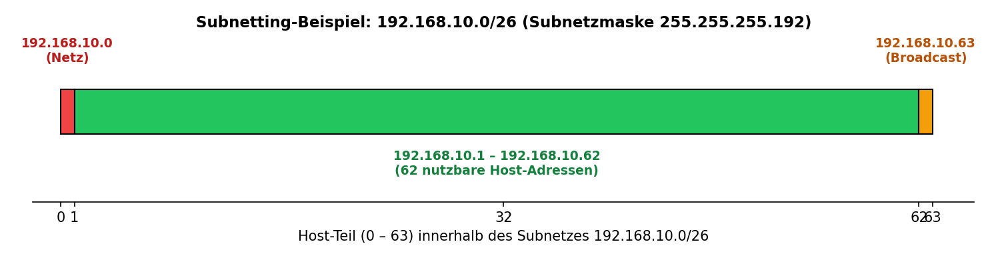
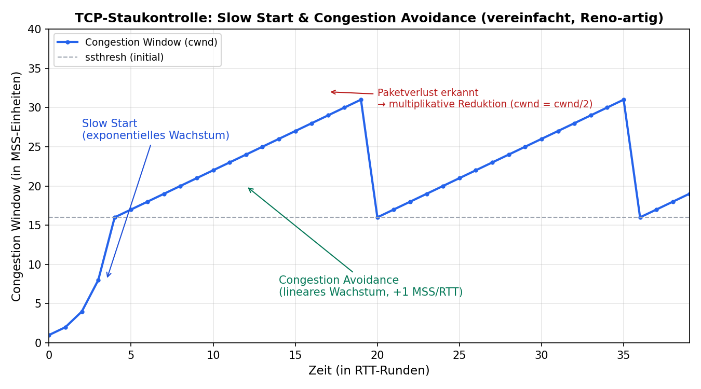

# Das ISO/OSI-Referenzmodell – Die Schichten 1 bis 4 im Detail

> Eine ausführliche Übersicht auf Universitätsniveau zu den unteren vier Schichten des OSI-Modells (ISO/IEC 7498-1), inklusive Geräte- und Protokollzuordnung. Die Schichten 5–7 werden am Ende zur "Anwendungsschicht" zusammengefasst und nur grob erläutert.

---

## 1. Einleitung: Grundprinzipien des OSI-Modells

Das **OSI-Modell** (*Open Systems Interconnection*) wurde 1984 von der ISO als **Referenzmodell** (nicht als konkrete Implementierung) standardisiert, um Netzwerkkommunikation in klar abgegrenzte Funktionsbereiche zu unterteilen. Es dient primär didaktischen und konzeptionellen Zwecken – im praktischen Internet dominiert das schlankere TCP/IP-Modell, das OSI-Modell bleibt jedoch die zentrale Referenz zur Analyse und Fehlersuche in Netzwerken.

**Kernprinzipien:**

- **Schichtentrennung (Separation of Concerns):** Jede Schicht erfüllt eine klar abgegrenzte Aufgabe und ist von der Implementierung der anderen Schichten unabhängig.
- **Dienstschnittstellen (SAP – Service Access Point):** Jede Schicht bietet der darüberliegenden Schicht über eine definierte Schnittstelle einen Dienst an und nutzt selbst die Dienste der darunterliegenden Schicht.
- **Peer-to-Peer-Kommunikation:** Zwei gleichnamige Schichten auf Sender- und Empfängerseite "kommunizieren" logisch über ein Protokoll miteinander (horizontale Kommunikation), tatsächlich erfolgt der Datentransport aber immer vertikal durch den lokalen Protokollstapel.
- **Kapselung (Encapsulation):** Beim Durchlaufen der Schichten von oben nach unten fügt jede Schicht einen eigenen **Header** (teilweise auch einen **Trailer**) hinzu. Das Ergebnis ist die jeweilige **PDU (Protocol Data Unit)** dieser Schicht.

```
Anwendungsdaten
   └─(4)→ Segment   = Transport-Header + Daten
      └─(3)→ Paket     = Netzwerk-Header + Segment
         └─(2)→ Frame     = Sicherungs-Header + Paket + Sicherungs-Trailer
            └─(1)→ Bitstrom = physikalische Signale
```

---

## 2. Kurzübersicht aller sieben Schichten

| # | Schicht (DE) | Schicht (EN) | PDU | Kernfunktion |
|---|---|---|---|---|
| 7 | Anwendung | Application | Daten | Netzwerkdienste für Anwendungen (HTTP, DNS, SMTP …) |
| 6 | Darstellung | Presentation | Daten | Formatierung, Verschlüsselung, Kompression |
| 5 | Sitzung | Session | Daten | Auf-/Abbau und Synchronisation von Sitzungen |
| **4** | **Transport** | **Transport** | **Segment** | **Ende-zu-Ende-Kommunikation, Ports, Flusskontrolle** |
| **3** | **Vermittlung** | **Network** | **Paket** | **Logische Adressierung, Routing** |
| **2** | **Sicherung** | **Data Link** | **Frame** | **MAC-Adressierung, Fehlererkennung, Medienzugriff** |
| **1** | **Bitübertragung** | **Physical** | **Bit** | **Physikalische Signalübertragung** |

Im Folgenden werden die fett markierten Schichten 1–4 ausführlich behandelt. Schichten 5–7 folgen am Ende zusammengefasst.

---

## 3. Schicht 1 – Bitübertragungsschicht (Physical Layer)

### 3.1 Aufgaben

Die Bitübertragungsschicht ist für die **physikalische Übertragung roher Bitfolgen** über ein Übertragungsmedium zuständig. Sie definiert:

- **Mechanische Eigenschaften:** Steckerformen, Pinbelegung, Kabeltypen (z. B. RJ45, LC-Stecker für Glasfaser)
- **Elektrische/optische Eigenschaften:** Spannungspegel, Signalstärke, Wellenlängen bei optischer Übertragung
- **Funktionale Eigenschaften:** Bedeutung einzelner Leitungen/Signale
- **Prozedurale Eigenschaften:** Ablauf beim Auf- und Abbau einer physikalischen Verbindung
- **Bitsynchronisation und Taktung** zwischen Sender und Empfänger
- **Leitungscodierung** (z. B. Manchester-Codierung, NRZ, 4B/5B) zur Umwandlung von Bits in physikalische Signale
- **Multiplexverfahren:** Zeitmultiplex (TDM), Frequenzmultiplex (FDM), Wellenlängenmultiplex (WDM)
- **Übertragungsmodus:** Simplex, Halbduplex, Vollduplex
- **Physikalische Netzwerktopologie:** Bus, Stern, Ring, Mesh

Wichtig: Auf dieser Schicht gibt es **keinerlei Bedeutung oder Struktur** der übertragenen Bits – es werden reine Signale übertragen, ohne Kenntnis darüber, was sie repräsentieren.

### 3.2 PDU

**Bit** (unstrukturierter Bitstrom)

### 3.3 Relevante Protokolle und Standards

- **IEEE 802.3** – physikalische Spezifikationen für Ethernet (z. B. 10BASE-T, 100BASE-TX, 1000BASE-T, 10GBASE-SR)
- **IEEE 802.11 (PHY-Teil)** – Funkübertragung bei WLAN
- **RS-232, V.35, USB (physikalische Ebene)**
- **DSL, SONET/SDH** – Übertragungstechniken im WAN-Bereich
- **Bluetooth PHY**

**Übertragungsmedien:** Twisted-Pair-Kupferkabel (Cat 5e/6/7), Koaxialkabel, Glasfaser (Singlemode/Multimode), Funkwellen (Mikrowelle, WLAN, Bluetooth)

### 3.4 Geräte auf Schicht 1

| Gerät | Funktion |
|---|---|
| **Repeater** | Verstärkt und regeneriert ein geschwächtes Signal, um die Reichweite zu erhöhen |
| **Hub** | Multiport-Repeater; leitet eingehende Signale ungefiltert an alle anderen Ports weiter (kein "Wissen" über Adressen) |
| **Netzwerkkabel/Stecker** | Physikalisches Übertragungsmedium (Kupfer, Glasfaser) |
| **Modem** | Wandelt digitale Signale in analoge Signale um (Modulation) und zurück (Demodulation), z. B. für DSL-Anschlüsse |
| **Medienkonverter** | Wandelt Signale zwischen unterschiedlichen physikalischen Medien um (z. B. Kupfer ↔ Glasfaser) |
| **Transceiver / SFP-Module** | Senden und Empfangen physikalischer Signale, oft steckbar in Switches/Router |

---

## 4. Schicht 2 – Sicherungsschicht (Data Link Layer)

### 4.1 Aufgaben

Die Sicherungsschicht sorgt für eine **zuverlässige Datenübertragung über ein einzelnes physikalisches Segment** (bzw. zwischen direkt benachbarten Knoten) und stellt der Netzwerkschicht einen (weitgehend) fehlerfreien Übertragungsdienst zur Verfügung.

- **Rahmenbildung (Framing):** Aufteilung des Bitstroms in logische Einheiten (Frames) mit definiertem Anfang und Ende
- **Physikalische Adressierung:** Nutzung von **MAC-Adressen** (48 Bit, herstellergebunden) zur eindeutigen Identifikation von Netzwerkschnittstellen innerhalb eines lokalen Segments
- **Fehlererkennung:** meist mittels **CRC (Cyclic Redundancy Check)** im Trailer; teils auch Fehlerkorrektur
- **Flusskontrolle:** Anpassung der Übertragungsgeschwindigkeit an die Verarbeitungskapazität des Empfängers
- **Medienzugriffssteuerung (Media Access Control):** Regelung, wann welcher Teilnehmer auf ein gemeinsam genutztes Medium zugreifen darf
  - **CSMA/CD** (Carrier Sense Multiple Access/Collision Detection) – klassisches (heute kaum noch relevantes) Ethernet bei Halbduplex-Betrieb
  - **CSMA/CA** (Collision Avoidance) – bei WLAN, da Kollisionserkennung auf Funkmedien kaum möglich ist

### 4.2 Unterschichten (nach IEEE 802)

Die IEEE unterteilt die Sicherungsschicht in zwei Teilschichten:

1. **LLC (Logical Link Control, IEEE 802.2):** obere Teilschicht; stellt die Schnittstelle zur Netzwerkschicht bereit und ermöglicht das Multiplexing mehrerer Netzwerkschichtprotokolle über dasselbe physikalische Medium
2. **MAC (Media Access Control):** untere Teilschicht; regelt den Zugriff auf das physikalische Medium und ist für Adressierung sowie Framing zuständig

### 4.3 PDU

**Frame** (Rahmen)

### 4.4 Relevante Protokolle und Standards

- **Ethernet (IEEE 802.3)** – dominierender LAN-Standard
- **WLAN (IEEE 802.11)**
- **PPP (Point-to-Point Protocol)** – häufig bei Wählverbindungen/WAN-Strecken
- **HDLC (High-Level Data Link Control)**
- **VLAN-Tagging (IEEE 802.1Q)** – logische Segmentierung eines physischen Netzwerks
- **Spanning Tree Protocol, STP (IEEE 802.1D)** – verhindert Schleifen in vermaschten Switch-Topologien
- **ARP (Address Resolution Protocol)** – Sonderfall: löst IP-Adressen (Schicht 3) in MAC-Adressen (Schicht 2) auf und wird deshalb oft der "Schnittstelle" zwischen Schicht 2 und 3 zugeordnet

### 4.5 Geräte auf Schicht 2

| Gerät | Funktion |
|---|---|
| **Switch** | Lernt MAC-Adressen der angeschlossenen Geräte und leitet Frames gezielt nur an den relevanten Port weiter (im Gegensatz zum Hub) |
| **Bridge** | Verbindet zwei Netzwerksegmente und filtert Frames anhand von MAC-Adressen; Vorläufer des modernen Switches |
| **Netzwerkkarte (NIC)** | Besitzt eine eindeutige MAC-Adresse; vereint Funktionen der Schicht 1 (Signalübertragung) und Schicht 2 (Framing, Adressierung) |
| **Wireless Access Point** | Verwaltet den Medienzugriff (CSMA/CA) und die Frame-Verarbeitung im WLAN; wird oft Schicht 1+2 zugeordnet |

---

## 5. Schicht 3 – Vermittlungsschicht (Network Layer)

### 5.1 Aufgaben

Die Vermittlungsschicht ermöglicht die **Kommunikation über die Grenzen einzelner physikalischer Netzwerksegmente hinweg** (Internetworking) und ist damit die zentrale Schicht für die Wegewahl durch komplexe, aus vielen Teilnetzen bestehende Netzwerke.

- **Logische Adressierung:** Vergabe global (bzw. netzwerkweit) eindeutiger **IP-Adressen**, unabhängig von der physikalischen Hardware
- **Routing:** Bestimmung des optimalen Pfades eines Pakets durch ein Netz aus mehreren Teilnetzen anhand von Routingtabellen und Routingprotokollen
- **Forwarding:** tatsächliche Weiterleitung eines Pakets anhand der Zieladresse an den nächsten Hop
- **Fragmentierung und Reassemblierung:** Aufteilung von Paketen, wenn diese die maximale Übertragungseinheit (MTU) eines Teilnetzes überschreiten, und Wiederzusammensetzung beim Empfänger
- **Verbindungslose vs. verbindungsorientierte Vermittlung:** IP arbeitet grundsätzlich verbindungslos (jedes Paket wird unabhängig geroutet); historische Alternativen wie X.25 arbeiteten verbindungsorientiert

### 5.2 PDU

**Paket** (Packet)

### 5.3 Relevante Protokolle

- **IPv4 / IPv6** – zentrale Adressierungs- und Vermittlungsprotokolle des Internets
- **ICMP (Internet Control Message Protocol)** – Diagnose- und Fehlermeldungen (z. B. genutzt von `ping` und `traceroute`)
- **IGMP (Internet Group Management Protocol)** – Verwaltung von Multicast-Gruppen
- **Routingprotokolle:** RIP, OSPF, EIGRP (Interior Gateway Protocols) sowie BGP (Exterior Gateway Protocol, zentrales Routingprotokoll des Internets zwischen autonomen Systemen)
- **IPsec** – Verschlüsselung/Authentifizierung auf Vermittlungsschichtebene

### 5.4 Geräte auf Schicht 3

| Gerät | Funktion |
|---|---|
| **Router** | Verbindet unterschiedliche Netzwerke/Subnetze und trifft anhand der Routingtabelle Entscheidungen über den Weiterleitungspfad eines Pakets |
| **Layer-3-Switch** | Kombiniert klassische Switching-Funktionalität (Schicht 2) mit Routingfunktionen (Schicht 3) innerhalb eines Geräts |
| **Firewall (paketfilternd)** | Analysiert und filtert Pakete anhand von IP-Adressen und Protokollinformationen |
| **Gateway (i. e. S.)** | Setzt zwischen unterschiedlichen Netzwerkprotokollen um |

---

## 6. Schicht 4 – Transportschicht (Transport Layer)

### 6.1 Aufgaben

Die Transportschicht stellt die **Ende-zu-Ende-Kommunikation zwischen Anwendungsprozessen** (nicht nur zwischen Hosts) sicher und ist die unterste Schicht, die sich um den Inhalt und die Zuverlässigkeit der Kommunikation zwischen den Endpunkten kümmert (im Gegensatz zu den darunterliegenden, eher "transportorientierten" Schichten).

- **Segmentierung:** Aufteilung der von oberen Schichten übergebenen Daten in transportierbare Einheiten
- **Multiplexing/Demultiplexing über Ports:** Ein Host kann gleichzeitig mehrere Anwendungen nutzen; die Kombination aus IP-Adresse und Portnummer (**Socket**) identifiziert einen eindeutigen Kommunikationsendpunkt
- **Verbindungsorientierte Übertragung (TCP):**
  - **Drei-Wege-Handshake** (SYN → SYN/ACK → ACK) zum Verbindungsaufbau
  - **Sequenznummern** zur Sicherstellung der richtigen Reihenfolge
  - **Flusskontrolle** mittels Sliding-Window-Verfahren
  - **Staukontrolle (Congestion Control)**, z. B. Slow Start, Congestion Avoidance
  - **Fehlerkontrolle** durch Bestätigungen (ACKs) und erneute Übertragung verlorener Segmente
- **Verbindungslose Übertragung (UDP):** keine Garantie für Zustellung, Reihenfolge oder Duplikatfreiheit; dafür minimaler Overhead und geringe Latenz – geeignet für Echtzeitanwendungen (VoIP, Streaming, Gaming)

### 6.2 PDU

**Segment** (bei TCP) bzw. **Datagramm** (bei UDP) – im deutschsprachigen Sprachgebrauch häufig einheitlich als "Segment" bezeichnet

### 6.3 Relevante Protokolle

- **TCP (Transmission Control Protocol)** – zuverlässig, verbindungsorientiert
- **UDP (User Datagram Protocol)** – schnell, verbindungslos, ohne Garantien
- **SCTP (Stream Control Transmission Protocol)** – Mischform, u. a. für Telekommunikationssignalisierung
- *(TLS/SSL wird in manchen Darstellungen als "zwischen" Transport- und Anwendungsschicht liegend beschrieben; im strengen OSI-Sinn wäre es eher Schicht 6 zuzuordnen)*

### 6.4 Geräte auf Schicht 4

| Gerät | Funktion |
|---|---|
| **Load Balancer (L4)** | Verteilt eingehende Verbindungen basierend auf IP-Adresse und Portnummer auf mehrere Server |
| **Stateful Firewall** | Überwacht den Zustand von TCP-Verbindungen (z. B. Verbindungsauf-/-abbau) und erlaubt nur legitime, bereits initiierte Verbindungen |

> **Hinweis:** Auf Schicht 4 und darüber handelt es sich zunehmend um **Softwarefunktionen** innerhalb von Servern, Firewalls oder Routern statt um eigenständige, klar abgrenzbare Hardware. Viele moderne Netzwerkgeräte (z. B. "Next-Generation Firewalls") verarbeiten mehrere Schichten gleichzeitig (**Multilayer-Geräte**).

---

## 7. Schichten 5–7 (zusammengefasst als "Anwendungsschicht")

Da diese Übersicht ihren Schwerpunkt auf die Schichten 1–4 legt, werden die oberen drei Schichten hier nur überblicksartig zusammengefasst:

- **Schicht 5 – Sitzungsschicht (Session Layer):** Auf-, Ab- und Wiederaufbau sowie Synchronisation von Kommunikationssitzungen zwischen Anwendungen (z. B. RPC, Sitzungsverwaltung in Datenbankverbindungen).
- **Schicht 6 – Darstellungsschicht (Presentation Layer):** Umwandlung, Verschlüsselung und Kompression von Daten in ein für die Anwendungsschicht verständliches Format (z. B. Zeichensatzkonvertierung, TLS/SSL, JPEG-Kompression).
- **Schicht 7 – Anwendungsschicht (Application Layer):** stellt die eigentlichen netzwerkbasierten Dienste für Endbenutzeranwendungen bereit, z. B. **HTTP/HTTPS** (Webbrowsing), **FTP** (Dateiübertragung), **SMTP/IMAP/POP3** (E-Mail), **DNS** (Namensauflösung), **DHCP** (automatische IP-Konfiguration), **SSH** (Fernzugriff).

**PDU:** Daten (Data) – auf diesen Schichten wird meist nicht mehr von einer eigenen PDU-Bezeichnung gesprochen.

**Typische Geräte/Systeme:** Endgeräte (PCs, Smartphones, Server), Application-Layer-Gateways, Proxy-Server, Next-Generation-Firewalls (Deep Packet Inspection), Load Balancer mit Layer-7-Funktionalität (Content-basierte Verteilung).

---

## 8. Zusammenfassende Gesamttabelle

| Schicht | Name | PDU | Kernaufgabe | Beispielprotokolle | Typische Geräte |
|---|---|---|---|---|---|
| 7–5 | Anwendungsschicht (zusammengefasst) | Daten | Anwendungsdienste, Formatierung, Sitzungsverwaltung | HTTP, FTP, SMTP, DNS, TLS | Endgeräte, Proxy, App-Gateway |
| 4 | Transport | Segment | Ende-zu-Ende-Verbindung, Ports, Fluss-/Staukontrolle | TCP, UDP, SCTP | Load Balancer (L4), Stateful Firewall |
| 3 | Vermittlung | Paket | Logische Adressierung, Routing | IP, ICMP, OSPF, BGP | Router, Layer-3-Switch |
| 2 | Sicherung | Frame | MAC-Adressierung, Framing, Medienzugriff | Ethernet, WLAN, PPP, ARP | Switch, Bridge, NIC |
| 1 | Bitübertragung | Bit | Physikalische Signalübertragung | Ethernet-PHY, Bluetooth-PHY | Hub, Repeater, Kabel, Modem |

---

## 9. Merkhilfe zur Reihenfolge

Eine mögliche Eselsbrücke (von Schicht 1 zu 7): **B**itte **S**chicke **V**iele **T**exte **S**chnell **D**urch **A**pplikationen
→ **B**itübertragung, **S**icherung, **V**ermittlung, **T**ransport, **S**itzung, **D**arstellung, **A**nwendung

---

## 10. Protokolle im Detail: Ethernet, IP, BGP, TCP, UDP

### 10.1 Ethernet (IEEE 802.3)

Ethernet ist der mit Abstand dominierende Standard der Sicherungsschicht (bzw. genauer: der MAC-Teilschicht) für kabelgebundene lokale Netze.

**Aufbau eines Ethernet-Frames:**

```
|--- 7 Byte ---|-1 Byte-|---6 Byte---|---6 Byte---|-2 Byte-|--- 46–1500 Byte ---|-4 Byte-|
|   Präambel   |  SFD   | Ziel-MAC   | Quell-MAC  |Typ/Länge|       Nutzdaten     |  FCS   |
```

| Feld | Größe | Bedeutung |
|---|---|---|
| Präambel | 7 Byte | Abwechselndes Bitmuster (10101010…) zur Bitsynchronisation zwischen Sender und Empfänger |
| SFD (Start Frame Delimiter) | 1 Byte | Markiert `10101011` – Beginn des eigentlichen Frames |
| Ziel-MAC-Adresse | 6 Byte | Physikalische Adresse des Empfängers |
| Quell-MAC-Adresse | 6 Byte | Physikalische Adresse des Senders |
| Typ/Länge (EtherType) | 2 Byte | Bei modernem Ethernet: Kennung des übergeordneten Protokolls (`0x0800` = IPv4, `0x0806` = ARP, `0x86DD` = IPv6) |
| Nutzdaten (Payload) | 46–1500 Byte | Eigentliche Daten (bei zu wenig Nutzdaten wird mit "Padding" aufgefüllt) |
| FCS (Frame Check Sequence) | 4 Byte | CRC-32-Prüfsumme zur Fehlererkennung |

Damit ergibt sich eine Gesamt-Framegröße (Ziel-MAC bis FCS) von **64 bis 1518 Byte**.

**MAC-Adressen:** 48 Bit lang, hexadezimal notiert (z. B. `00:1A:2B:3C:4D:5E`). Die ersten 24 Bit bilden das **OUI** (Organizationally Unique Identifier – herstellerspezifisch, von der IEEE vergeben), die letzten 24 Bit sind eine vom Hersteller vergebene, eindeutige Gerätenummer.

**Warum genau 64 Byte Mindestgröße? – Rechenbeispiel CSMA/CD:**

Damit eine Kollision im (historischen) Halbduplex-Ethernet zuverlässig erkannt werden kann, muss ein Sender noch senden, während ein möglicherweise kollidierendes Signal vom anderen Ende des Netzes zurückkommt. Die Sendezeit eines Frames muss daher mindestens der doppelten maximalen Signallaufzeit im Netz (Round-Trip-Delay) entsprechen – dieser Wert heißt **Slot Time**.

> **Rechenbeispiel:** Für klassisches 10-Mbit/s-Ethernet ist die Slot Time auf **512 Bitzeiten (51,2 µs)** festgelegt.
> - Bitzeit bei 10 Mbit/s: $t_{Bit} = \frac{1}{10 \times 10^6 \text{ s}^{-1}} = 100\text{ ns}$
> - Slot Time: $512 \times 100\text{ ns} = 51{.}200\text{ ns} = 51{,}2\ \mu s$
> - $512\text{ Bit} = 64\text{ Byte}$ → **daher die Mindestrahmengröße von 64 Byte**
>
> Ist ein Frame kürzer als 64 Byte ("Runt Frame"), könnte der Sender die Übertragung bereits beendet haben, bevor eine Kollision am anderen Ende erkannt und die entsprechende "Jam"-Nachricht zurückgesendet wurde – die Kollision bliebe unbemerkt.

Mit steigender Übertragungsrate (100 Mbit/s, 1 Gbit/s …) wird dieses Verhältnis bei gleicher Netzausdehnung zunehmend unpraktikabel. In der Praxis wurde das Problem gelöst, indem moderne Netze fast ausschließlich **vollduplex über Switches** betrieben werden – dort gibt es keine gemeinsam genutzte Leitung und damit auch keine Kollisionen mehr, wodurch CSMA/CD faktisch obsolet ist.

**Wichtige Ethernet-Standards:**

| Standard | Geschwindigkeit | Medium | Max. Segmentlänge |
|---|---|---|---|
| 10BASE-T | 10 Mbit/s | Cat 3 (Kupfer) | 100 m |
| 100BASE-TX (Fast Ethernet) | 100 Mbit/s | Cat 5 (Kupfer) | 100 m |
| 1000BASE-T (Gigabit Ethernet) | 1 Gbit/s | Cat 5e/6 (Kupfer) | 100 m |
| 10GBASE-T | 10 Gbit/s | Cat 6a (Kupfer) | 100 m |
| 10GBASE-SR | 10 Gbit/s | Glasfaser (Multimode) | ca. 300 m |

---

### 10.2 IP (Internet Protocol)

**IPv4-Header (20 Byte Standardgröße):**

```
 0                   1                   2                   3
 0 1 2 3 4 5 6 7 8 9 0 1 2 3 4 5 6 7 8 9 0 1 2 3 4 5 6 7 8 9 0 1
+-+-+-+-+-+-+-+-+-+-+-+-+-+-+-+-+-+-+-+-+-+-+-+-+-+-+-+-+-+-+-+-+
|Version|  IHL  |  ToS/DSCP     |         Gesamtlänge            |
+-+-+-+-+-+-+-+-+-+-+-+-+-+-+-+-+-+-+-+-+-+-+-+-+-+-+-+-+-+-+-+-+
|         Identifikation       |Flags|    Fragment-Offset       |
+-+-+-+-+-+-+-+-+-+-+-+-+-+-+-+-+-+-+-+-+-+-+-+-+-+-+-+-+-+-+-+-+
|      TTL      |   Protokoll   |        Header-Prüfsumme       |
+-+-+-+-+-+-+-+-+-+-+-+-+-+-+-+-+-+-+-+-+-+-+-+-+-+-+-+-+-+-+-+-+
|                       Quell-IP-Adresse                        |
+-+-+-+-+-+-+-+-+-+-+-+-+-+-+-+-+-+-+-+-+-+-+-+-+-+-+-+-+-+-+-+-+
|                       Ziel-IP-Adresse                         |
+-+-+-+-+-+-+-+-+-+-+-+-+-+-+-+-+-+-+-+-+-+-+-+-+-+-+-+-+-+-+-+-+
|                    Optionen (variabel, selten genutzt)         |
+-+-+-+-+-+-+-+-+-+-+-+-+-+-+-+-+-+-+-+-+-+-+-+-+-+-+-+-+-+-+-+-+
```

| Feld | Bedeutung |
|---|---|
| Version | 4 = IPv4 |
| IHL (Internet Header Length) | Länge des Headers in 32-Bit-Worten (min. 5 = 20 Byte) |
| ToS/DSCP | Priorisierung/Dienstgüte (Quality of Service) |
| Gesamtlänge | Länge von Header + Daten, max. 65.535 Byte |
| Identifikation/Flags/Fragment-Offset | Steuerung der Fragmentierung, falls das Paket größer als die MTU eines Teilnetzes ist |
| TTL (Time to Live) | Wird bei jedem Router um 1 verringert; bei 0 wird das Paket verworfen (verhindert Endlos-Routing-Schleifen) |
| Protokoll | Kennzeichnet das Transportprotokoll (1 = ICMP, 6 = TCP, 17 = UDP) |
| Header-Prüfsumme | Fehlererkennung nur für den Header |
| Quell-/Ziel-IP-Adresse | 32-Bit-Adressen von Sender und Empfänger |

**Rechenbeispiel: Subnetting mit CIDR-Notation**

Gegeben sei das Netz `192.168.10.0/26`. Gesucht: Subnetzmaske, Anzahl nutzbarer Hosts, Netz- und Broadcast-Adresse, gültiger Hostbereich.

> **Rechnung:**
> 1. `/26` bedeutet 26 Bit Netzanteil, also $32-26=6$ Bit Hostanteil
> 2. Subnetzmaske: `11111111.11111111.11111111.11000000` = **255.255.255.192**
> 3. Gesamtzahl der Adressen im Subnetz: $2^6 = 64$
> 4. Nutzbare Host-Adressen: $2^6 - 2 = 62$ (abzüglich Netz- und Broadcast-Adresse)
> 5. Netzadresse: **192.168.10.0**
> 6. Broadcast-Adresse: **192.168.10.63**
> 7. Gültiger Hostbereich: **192.168.10.1 – 192.168.10.62**



**Longest-Prefix-Match (Routing-Beispiel):**

Router treffen ihre Weiterleitungsentscheidung stets anhand des **spezifischsten (längsten) passenden Präfixes** in der Routingtabelle – nicht anhand des erstbesten Treffers:

| Ziel-Netz (Eintrag in der Routingtabelle) | Ausgangsinterface |
|---|---|
| `0.0.0.0/0` (Default-Route) | Interface A |
| `192.168.0.0/16` | Interface B |
| `192.168.10.0/24` | Interface C |
| `192.168.10.0/26` | Interface D |

Für ein Ziel-Paket an **192.168.10.45** passen theoretisch *alle vier* Einträge – gewählt wird jedoch der Eintrag mit der längsten Präfixlänge, hier `/26`, also **Interface D**.

**IPv6 – kurzer Vergleich:** 128-Bit-Adressen (statt 32 Bit bei IPv4), hexadezimale Notation (z. B. `2001:0db8::1`), vereinfachter Header ohne eingebaute Fragmentierung durch Router, kein NAT mehr zwingend notwendig aufgrund des riesigen Adressraums ($2^{128}$ Adressen).

---

### 10.3 BGP (Border Gateway Protocol)

BGP ist das **Exterior-Gateway-Protokoll (EGP)**, das das Routing *zwischen* autonomen Systemen (AS) im Internet regelt – im Gegensatz zu Interior-Gateway-Protokollen wie OSPF, die *innerhalb* eines AS eingesetzt werden. BGP ist im Kern das Protokoll, das die globale Routingtabelle des Internets zusammenhält.

- **Autonomes System (AS):** Ein Verbund von IP-Netzen unter einer einheitlichen administrativen Kontrolle und Routingpolitik, identifiziert durch eine eindeutige **AS-Nummer**.
- **Path-Vector-Protokoll:** BGP tauscht nicht nur eine Metrik (wie Distance-Vector-Protokolle), sondern den **vollständigen AS-Pfad** aus, den eine Route bereits durchlaufen hat. Taucht die eigene AS-Nummer bereits im Pfad auf, wird die Route verworfen – dies verhindert Routingschleifen.
- **eBGP vs. iBGP:**
  - **eBGP (external BGP):** Sitzung zwischen Routern in *unterschiedlichen* AS
  - **iBGP (internal BGP):** Sitzung zwischen Routern *innerhalb* desselben AS, notwendig, um extern gelernte Routen intern zu verteilen (häufig über Route-Reflectoren, um ein volles Mesh zu vermeiden)
- **Transport:** BGP-Sitzungen laufen über **TCP Port 179** – BGP verlässt sich also auf die Zuverlässigkeit der Transportschicht, statt eigene Mechanismen zur gesicherten Übertragung zu implementieren.

**Auswahl des besten Pfades (vereinfachte Reihenfolge der wichtigsten Kriterien):**

| Priorität | Kriterium | Bedeutung |
|---|---|---|
| 1 | Höchste `LOCAL_PREF` | lokal (innerhalb des AS) festgelegte Präferenz |
| 2 | Kürzester `AS-PATH` | wenigste durchlaufene autonome Systeme |
| 3 | Niedrigster `ORIGIN`-Typ | Ursprung der Route (IGP < EGP < incomplete) |
| 4 | Niedrigster `MED` (Multi-Exit Discriminator) | Präferenz beim Eintritt in ein benachbartes AS |
| 5 | eBGP vor iBGP | extern gelernte Routen bevorzugt |
| 6 | Niedrigste IGP-Metrik zum Next-Hop | kürzester interner Weg |

**Wichtige BGP-Nachrichtentypen:** `OPEN` (Sitzungsaufbau), `UPDATE` (Ankündigung/Rücknahme von Routen), `KEEPALIVE` (Aufrechterhaltung der Sitzung), `NOTIFICATION` (Fehlermeldung/Sitzungsabbruch).

---

### 10.4 TCP (Transmission Control Protocol)

**TCP-Header (mindestens 20 Byte):**

```
 0                   1                   2                   3
 0 1 2 3 4 5 6 7 8 9 0 1 2 3 4 5 6 7 8 9 0 1 2 3 4 5 6 7 8 9 0 1
+-+-+-+-+-+-+-+-+-+-+-+-+-+-+-+-+-+-+-+-+-+-+-+-+-+-+-+-+-+-+-+-+
|        Quell-Port            |         Ziel-Port              |
+-+-+-+-+-+-+-+-+-+-+-+-+-+-+-+-+-+-+-+-+-+-+-+-+-+-+-+-+-+-+-+-+
|                        Sequenznummer                          |
+-+-+-+-+-+-+-+-+-+-+-+-+-+-+-+-+-+-+-+-+-+-+-+-+-+-+-+-+-+-+-+-+
|                   Bestätigungsnummer (ACK)                    |
+-+-+-+-+-+-+-+-+-+-+-+-+-+-+-+-+-+-+-+-+-+-+-+-+-+-+-+-+-+-+-+-+
|Offset |Reserv.|U|A|P|R|S|F|         Fenstergröße               |
+-+-+-+-+-+-+-+-+-+-+-+-+-+-+-+-+-+-+-+-+-+-+-+-+-+-+-+-+-+-+-+-+
|          Prüfsumme            |        Urgent-Pointer         |
+-+-+-+-+-+-+-+-+-+-+-+-+-+-+-+-+-+-+-+-+-+-+-+-+-+-+-+-+-+-+-+-+
|                    Optionen (variabel)                        |
+-+-+-+-+-+-+-+-+-+-+-+-+-+-+-+-+-+-+-+-+-+-+-+-+-+-+-+-+-+-+-+-+
```

**Flags:** `URG` (Urgent), `ACK` (Acknowledgment gültig), `PSH` (Push – sofort an Anwendung weitergeben), `RST` (Reset – Verbindungsabbruch), `SYN` (Verbindungsaufbau), `FIN` (Verbindungsende).

**Verbindungsaufbau – Drei-Wege-Handshake:**

```
Client                                        Server
  |------------- SYN (seq = x) ---------------->|
  |<------- SYN/ACK (seq = y, ack = x+1) --------|
  |------------- ACK (ack = y+1) --------------->|
  |               Verbindung steht                |
```

**Verbindungsabbau – Vier-Wege-Terminierung:**

```
Client                                        Server
  |-------------- FIN (seq = x) ----------------->|
  |<------------------ ACK ------------------------|
  |<----------------- FIN (seq = y) ---------------|
  |------------------- ACK ----------------------->|
```

**Flusskontrolle & Rechenbeispiel Durchsatz (Sliding Window):**

Der maximale Durchsatz einer TCP-Verbindung ist durch die Fenstergröße (Window Size) und die Round-Trip-Time (RTT) begrenzt:

$$\text{Max. Durchsatz} = \frac{\text{Fenstergröße}}{\text{RTT}}$$

> **Rechenbeispiel:** Fenstergröße = 65.535 Byte (Standardmaximum ohne *Window Scaling*), RTT = 100 ms
> $$\text{Durchsatz} = \frac{65.535 \text{ Byte} \times 8}{0{,}1\text{ s}} = \frac{524.280\text{ Bit}}{0{,}1\text{ s}} \approx 5{,}24\text{ Mbit/s}$$
> Auch bei einer Gigabit-Leitung könnten so nie mehr als ca. 5,24 Mbit/s genutzt werden – deshalb existiert die **Window-Scaling-Option (RFC 1323)**, die größere Fenster erlaubt.

**Bandwidth-Delay-Product (BDP):** beschreibt, wie viele Daten "unterwegs" sein müssen, um eine Leitung voll auszulasten:

> **Rechenbeispiel:** Leitung mit 100 Mbit/s, RTT = 80 ms
> $$BDP = 100.000.000\ \text{Bit/s} \times 0{,}08\text{ s} = 8.000.000\ \text{Bit} \approx 977\ \text{KByte}$$
> Ohne Window Scaling (max. 64 KByte Fenster) lässt sich diese Leitung folglich nie vollständig auslasten.

**Staukontrolle (Congestion Control):** TCP passt die Sendemenge dynamisch an die vermutete Netzwerkauslastung an – unabhängig von der durch den Empfänger vorgegebenen Fenstergröße:

- **Slow Start:** Das Congestion Window (cwnd) wächst zu Beginn **exponentiell** (Verdopplung pro RTT), bis ein Schwellenwert (`ssthresh`) erreicht wird.
- **Congestion Avoidance:** Danach wächst cwnd nur noch **linear** (additiv, +1 MSS pro RTT) – ein Verfahren namens *Additive Increase*.
- **Bei erkanntem Paketverlust:** cwnd wird drastisch reduziert (*Multiplicative Decrease*, meist halbiert) – zusammen als **AIMD (Additive Increase / Multiplicative Decrease)** bezeichnet.



---

### 10.5 UDP (User Datagram Protocol)

**UDP-Header (fest 8 Byte, deutlich schlanker als TCP):**

```
 0                   1                   2                   3
 0 1 2 3 4 5 6 7 8 9 0 1 2 3 4 5 6 7 8 9 0 1 2 3 4 5 6 7 8 9 0 1
+-+-+-+-+-+-+-+-+-+-+-+-+-+-+-+-+-+-+-+-+-+-+-+-+-+-+-+-+-+-+-+-+
|        Quell-Port            |         Ziel-Port              |
+-+-+-+-+-+-+-+-+-+-+-+-+-+-+-+-+-+-+-+-+-+-+-+-+-+-+-+-+-+-+-+-+
|            Länge              |          Prüfsumme             |
+-+-+-+-+-+-+-+-+-+-+-+-+-+-+-+-+-+-+-+-+-+-+-+-+-+-+-+-+-+-+-+-+
```

UDP kennt **keine** Sequenznummern, **keine** Bestätigungen, **kein** Sliding Window und **keine** Staukontrolle – es sendet Datagramme "fire-and-forget".

**Vergleich TCP vs. UDP:**

| Kriterium | TCP | UDP |
|---|---|---|
| Verbindungsart | verbindungsorientiert (Handshake) | verbindungslos |
| Zuverlässigkeit | garantierte Zustellung, Neuübertragung bei Verlust | keine Garantie |
| Reihenfolge | garantiert (Sequenznummern) | nicht garantiert |
| Flusskontrolle | ja (Sliding Window) | nein |
| Staukontrolle | ja (Slow Start, AIMD) | nein |
| Header-Größe | 20 Byte | 8 Byte |
| Geschwindigkeit/Latenz | geringer, mehr Overhead | höher, minimaler Overhead |
| Typische Anwendungen | HTTP/HTTPS, FTP, SMTP, SSH | DNS, DHCP, VoIP, Video-Streaming, Online-Gaming |

> **Rechenbeispiel Overhead:** Bei 1000 Byte Nutzdaten pro Paket beträgt der relative Header-Overhead bei TCP $\frac{20}{1020} \approx 1{,}96\%$, bei UDP dagegen nur $\frac{8}{1008} \approx 0{,}79\%$ – ein Grund, warum UDP bei latenzkritischen Echtzeitanwendungen bevorzugt wird, auch wenn dafür Zuverlässigkeit "geopfert" wird.

---

## 11. Funktionsweise ausgewählter Netzwerkgeräte

### 11.1 Hub

Ein Hub ist ein reines **Schicht-1-Gerät**: Er kennt weder MAC- noch IP-Adressen, sondern regeneriert ein eingehendes elektrisches Signal und sendet es **ungefiltert an alle anderen Ports** – faktisch ein Mehrport-Repeater.

- Alle angeschlossenen Geräte teilen sich **eine einzige Kollisionsdomäne** und die gesamte verfügbare Bandbreite.
- Da alle Ports denselben "Draht" logisch teilen, ist nur **Halbduplex-Betrieb** möglich (gleichzeitiges Senden und Empfangen würde zu einer Kollision führen).

> **Rechenbeispiel:** Ein 100-Mbit/s-Hub mit 8 angeschlossenen Geräten teilt die Bandbreite bei Volllast rechnerisch auf: $\frac{100\text{ Mbit/s}}{8} = 12{,}5\text{ Mbit/s}$ pro Gerät – in der Praxis oft noch weniger, da CSMA/CD durch Kollisionserkennung und Backoff-Wartezeiten zusätzlichen Overhead erzeugt.

Hubs gelten heute als technisch überholt und wurden nahezu vollständig durch Switches ersetzt.

### 11.2 Repeater

Ebenfalls ein reines **Schicht-1-Gerät**: Ein Repeater **regeneriert** (nicht nur verstärkt) ein elektrisches oder optisches Signal, um Dämpfungseffekte auf langen Leitungen auszugleichen und die maximale Reichweite eines Segments zu verlängern. "Regenerieren" bedeutet, dass das Signal neu geformt und neu getaktet wird – im Gegensatz zu einer reinen Verstärkung würde dabei auch aufgesammeltes Rauschen nicht mit verstärkt.

Bei klassischem 10-Mbit/s-Ethernet galt die **5-4-3-Regel**: maximal 5 Segmente, verbunden durch 4 Repeater, wobei nur 3 dieser Segmente tatsächlich Endgeräte tragen durften – eine direkte Konsequenz aus der oben berechneten Slot-Time-Grenze von 51,2 µs.

### 11.3 Modem

Ein Modem (**Mo**dulator/**Dem**odulator) wandelt digitale Signale eines Endgeräts in analoge Signale für ein Übertragungsmedium (klassisch: Telefonleitung) um – und umgekehrt. Gängige Modulationsverfahren: **ASK** (Amplitude Shift Keying), **FSK** (Frequency Shift Keying), **PSK** (Phase Shift Keying) sowie **QAM** (Quadratur-Amplitudenmodulation, Kombination aus Amplitude und Phase – bei DSL- und Kabelmodems für hohe Datenraten eingesetzt).

**Rechenbeispiel: Kanalkapazität nach Shannon-Hartley**

$$C = B \times \log_2\left(1 + \frac{S}{N}\right)$$

> Für einen klassischen analogen Telefonkanal mit Bandbreite $B = 3000\text{ Hz}$ und einem Signal-Rausch-Verhältnis von 30 dB (entspricht $\frac{S}{N} = 10^{30/10} = 1000$):
> $$C = 3000 \times \log_2(1001) \approx 3000 \times 9{,}97 \approx 29.900\ \text{Bit/s} \approx 30\ \text{kBit/s}$$
> Diese theoretische Obergrenze erklärt, warum klassische analoge Modems (V.34 u. Ä.) auf rund 30–33 kBit/s begrenzt waren, bevor digitale Techniken (z. B. ISDN-gestützte 56k-Modems, DSL mit deutlich größerer Bandbreite von mehreren hundert kHz bis wenigen MHz) höhere Datenraten ermöglichten.

### 11.4 Switch

Ein Switch ist im Kern ein **intelligenter Mehrport-Bridge**, klassisch der Sicherungsschicht (Schicht 2) zugeordnet.

- **MAC-Adresstabelle (CAM-Table):** Der Switch beobachtet die Quell-MAC-Adresse jedes eingehenden Frames und speichert sie zusammen mit dem Empfangsport (**Backward Learning**), inklusive eines Aging-Timers (typischerweise 300 s), nach dem veraltete Einträge verworfen werden.
- **Weiterleitungsentscheidung:**
  - Ziel-MAC bekannt → Frame wird **gezielt nur an den passenden Port** weitergeleitet (*Filtering*)
  - Ziel-MAC unbekannt → Frame wird wie beim Hub an **alle** Ports geflutet (*Flooding*)
  - Broadcast/Multicast → wird grundsätzlich geflutet
- **Weiterleitungsmodi:**
  - *Store-and-Forward*: kompletter Frame wird gepuffert, CRC geprüft, dann weitergeleitet – sicherste, aber langsamste Methode
  - *Cut-Through*: Weiterleitung beginnt bereits nach dem Lesen der Ziel-MAC-Adresse – geringe Latenz, aber keine Fehlerprüfung
  - *Fragment-Free*: Kompromiss – es werden die ersten 64 Byte abgewartet, um zumindest kollisionsbedingte "Runt Frames" auszufiltern
- **Kollisionsdomänen:** Jeder Switch-Port bildet eine **eigene Kollisionsdomäne** – im Vollduplex-Betrieb entfallen Kollisionen sogar vollständig.

> **Rechenbeispiel Backplane-Kapazität:** Ein nicht-blockierender 24-Port-Gigabit-Switch benötigt im Vollduplex-Betrieb eine interne Vermittlungskapazität von mindestens $24 \times 1\text{ Gbit/s} \times 2 = 48\text{ Gbit/s}$, damit alle Ports gleichzeitig mit voller Geschwindigkeit senden und empfangen können ("Wirespeed").

### 11.5 Bridge

Eine Bridge arbeitet nach demselben Prinzip wie ein Switch (**Transparent Bridging**: Lernen, Fluten, Filtern), historisch jedoch meist mit nur zwei bis wenigen Ports und eher softwarebasiert umgesetzt. Man kann einen modernen Switch als **hardwarebeschleunigte Multiport-Bridge** verstehen. Bridges (und Switches) setzen bei redundanten Topologien das **Spanning Tree Protocol (STP, IEEE 802.1D)** ein, um Schleifen und die daraus resultierenden Broadcast-Stürme zu verhindern.

### 11.6 Router

Ein Router ist ein **Schicht-3-Gerät**, das unterschiedliche Netzwerke bzw. **Broadcast-Domänen** miteinander verbindet – jede Schnittstelle (Interface) besitzt dabei ein eigenes IP-Subnetz und eine eigene MAC-Adresse.

**Ablauf der Paketweiterleitung:**
1. Eingehender Frame wird auf Schicht 2 entkapselt
2. Das enthaltene IP-Paket wird ausgewertet (Ziel-IP, TTL)
3. TTL wird um 1 verringert (bei TTL = 0 wird das Paket verworfen)
4. Per **Longest-Prefix-Match** wird der passende Eintrag in der Routingtabelle gesucht (siehe Rechenbeispiel in Abschnitt 10.2)
5. Das Paket wird mit einem **neuen** Schicht-2-Header für das Zielsegment neu gekapselt und über das ermittelte Ausgangsinterface gesendet

**Routing-Algorithmen (Übersicht):**

| Typ | Prinzip | Beispielprotokoll |
|---|---|---|
| Distance-Vector | Austausch von Entfernungsangaben (z. B. Hop-Count) zu Nachbarn, Berechnung via Bellman-Ford | RIP |
| Link-State | Jeder Router kennt die vollständige Netztopologie, Berechnung via Dijkstra (kürzester Pfad) | OSPF |
| Path-Vector | Austausch vollständiger AS-Pfade zur Vermeidung von Schleifen | BGP |

Im Gegensatz zu einem Switch **trennt** ein Router Broadcast-Domänen: Ein Broadcast in Netz A wird von einem Router nicht automatisch in Netz B weitergeleitet.

### 11.7 Layer-3-Switch (und die Frage nach "Schicht 2,5")

Ein Layer-3-Switch verbindet zwei Welten: die **hohe Weiterleitungsgeschwindigkeit** eines klassischen Switches mit der **Fähigkeit eines Routers**, Pakete anhand von IP-Adressen zwischen unterschiedlichen Subnetzen bzw. VLANs weiterzuleiten (**Inter-VLAN-Routing**).

**Warum wird er oft als "Schicht 2,5"-Gerät bezeichnet?**

- Ein **klassischer Router** trifft seine Routing-Entscheidung traditionell **softwarebasiert**: Für jedes einzelne Paket wertet die CPU den IP-Header aus, schlägt die Routingtabelle nach und kapselt neu – vergleichsweise langsam.
- Ein **Layer-3-Switch** implementiert diese Logik größtenteils in **spezialisierter Hardware** (ASICs, TCAM – Ternary Content Addressable Memory). Ein gängiges Verfahren dabei ist **"Route once, switch many"**: Der *erste* Frame eines Datenstroms wird noch klassisch per Software geroutet; das Ergebnis (Ziel-MAC, Ausgangsport, ggf. neuer VLAN-Tag) wird in einer Hardware-Tabelle zwischengespeichert. **Alle nachfolgenden Pakete desselben Datenstroms** werden dann direkt in Hardware – mit annähernder Switching-Geschwindigkeit ("Wirespeed") – weitergeleitet, ohne erneut die vollständige Software-Routing-Pipeline zu durchlaufen.
- Das Gerät **verhält sich** also technisch wie ein Switch (Hardware-Forwarding, hohe Portdichte, minimale Latenz), **entscheidet** aber wie ein Router anhand von **Schicht-3-Informationen**. Funktional liegt es damit "zwischen" einem reinen Layer-2-Switch und einem klassischen, softwarebasierten Router – daher die umgangssprachliche Bezeichnung **"Schicht 2,5"**.

> **Hinweis:** Der Begriff "Schicht 2,5" wird in der Netzwerktechnik auch in einem zweiten, davon unabhängigen Kontext verwendet – bei **MPLS (Multiprotocol Label Switching)**, wo ein zusätzliches Label zwischen Schicht-2- und Schicht-3-Header eingefügt wird, um Pakete anhand kurzer Labels statt vollständiger IP-Header-Analyse weiterzuleiten. Beide Verwendungen beschreiben technisch unterschiedliche Konzepte, die jedoch beide Routing-Intelligenz mit Switching-Geschwindigkeit verbinden.

Layer-3-Switches ersetzen in modernen Campus-/Enterprise-Netzen häufig das früher übliche **"Router-on-a-Stick"**-Design (ein einzelner Router mit einer einzigen Trunk-Verbindung zum Switch), das durch die eine physische Uplink-Leitung stark bandbreitenlimitiert war.

### 11.8 Firewall

Eine Firewall filtert Netzwerkverkehr anhand definierter Regeln und kann je nach Typ auf unterschiedlichen OSI-Schichten arbeiten:

| Typ | Schicht | Funktionsweise |
|---|---|---|
| **Paketfilternde Firewall (stateless)** | 3/4 | Prüft einzelne Pakete isoliert anhand von IP-Adresse, Port, Protokoll – ohne Kenntnis des Verbindungszustands |
| **Stateful Firewall** | 3/4 | Führt eine Zustandstabelle aktiver Verbindungen (*Connection Tracking*); lässt z. B. nur Antwortpakete zu bereits von innen initiierten Verbindungen zu |
| **Proxy-/Application-Layer-Firewall** | 7 | Terminiert die Verbindung vollständig und baut sie neu zum Ziel auf; kann den tatsächlichen Anwendungsinhalt prüfen (z. B. HTTP-Requests) |
| **Next-Generation Firewall (NGFW)** | 3–7 | Kombiniert Stateful Inspection mit Deep Packet Inspection, Intrusion Prevention und Anwendungserkennung |

**Beispiel einer regelbasierten Zugriffsliste (ACL):**

| Regel | Quelle | Ziel | Port | Aktion |
|---|---|---|---|---|
| 1 | 192.168.1.0/24 | beliebig | 80, 443 | ERLAUBEN |
| 2 | Admin-IP | 192.168.1.100 | 22 | ERLAUBEN |
| 3 | beliebig | beliebig | beliebig | **VERWEIGERN** (Default Deny) |

Das Prinzip **"Default Deny"** (nur explizit Erlaubtes passiert) gilt in der Praxis als deutlich sicherer als **"Default Allow"** (nur explizit Verbotenes wird blockiert), da unbekannter/neuer Verkehr im ersten Fall automatisch blockiert wird.

### 11.9 Proxy

Ein Proxy ist ein Vermittlungsserver, der auf **Schicht 7** arbeitet, da er das jeweilige Anwendungsprotokoll (z. B. HTTP) inhaltlich verstehen muss, um Anfragen sinnvoll weiterzuleiten – im Unterschied etwa zu NAT, das nur auf Schicht 3/4 Adressen umschreibt.

| Typ | Position | Hauptzwecke |
|---|---|---|
| **Forward-Proxy** | auf Client-Seite | Caching (reduziert redundanten Datenverkehr), Content-Filtering (z. B. Sperrung bestimmter Webseiten), Anonymisierung (verbirgt die reale Client-IP), Zugriffskontrolle in Firmennetzen |
| **Reverse-Proxy** | auf Server-Seite | Load Balancing auf Anwendungsebene, SSL/TLS-Terminierung (entlastet die Backend-Server), Caching statischer Inhalte, Verschleierung der internen Serverstruktur |

Der Client bzw. externe Nutzer merkt im Idealfall nicht, dass ein Proxy zwischengeschaltet ist – bei einem Forward-Proxy glaubt der Zielserver, direkt mit dem Proxy zu kommunizieren; bei einem Reverse-Proxy glaubt der Client, direkt mit dem eigentlichen Server zu sprechen.

### 11.10 Zusammenfassende Gerätetabelle

| Gerät | OSI-Schicht | Weiterleitung basiert auf | Kollisionsdomänen | Broadcast-Domänen |
|---|---|---|---|---|
| Hub | 1 | – (keine Intelligenz) | 1 gemeinsame Domäne für alle Ports | 1 gemeinsame Domäne |
| Repeater | 1 | – (Signalregeneration) | 1 gemeinsame Domäne | 1 gemeinsame Domäne |
| Modem | 1 | – (Modulation/Demodulation) | n/a | n/a |
| Switch | 2 | MAC-Adresse | je Port eigene Domäne | 1 gemeinsame Domäne (ohne VLANs) |
| Bridge | 2 | MAC-Adresse | je Segment eigene Domäne | 1 gemeinsame Domäne |
| Router | 3 | IP-Adresse | je Interface eigene Domäne | je Interface eigene Domäne |
| Layer-3-Switch | 2,5 / 3 | MAC- **und** IP-Adresse (hardwarebeschleunigt) | je Port eigene Domäne | je VLAN/Interface eigene Domäne |
| Firewall | 3–7 (je nach Typ) | Regelwerk (IP/Port/Protokoll/Inhalt) | – | – |
| Proxy | 7 | Anwendungsprotokoll-Inhalt | – | – |

---

*Diese Übersicht dient als Grundlage für die Prüfungsvorbereitung im Bereich Rechnernetze/Kommunikationssysteme und kann bei Bedarf um konkrete Beispiel-Paketmitschnitte (z. B. Wireshark) oder Übungsaufgaben ergänzt werden.*
